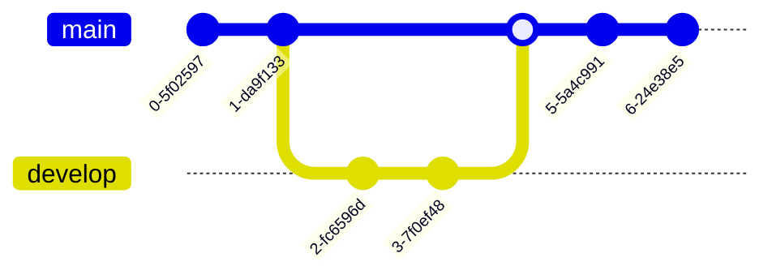

# Mermaid Diagrams

QuickDoc supports Mermaid diagrams for creating flowcharts, sequence diagrams, class diagrams, and more directly in your markdown files.

## Flowchart

Create flowcharts to visualize processes and workflows:


## Sequence Diagram

Visualize interactions between different components:


## Class Diagram

Document your application's structure:


## State Diagram

Show state transitions in your application:


## Git Graph

Visualize your branching strategy:



## Pie Chart

Display data distributions:


## Entity Relationship Diagram

Model your database schema:


## Journey Diagram

Map user experiences:


## Usage

### In Markdown Files

Simply use a code block with the `mermaid` language identifier:

\`\`\`mermaid
graph LR
    A[Start] --> B[End]
\`\`\`

### In MDX Files

You can also import and use the Mermaid component directly:

```mdx
import { Mermaid } from '../components';

<Mermaid chart={`
graph TD
    A[Start] --> B[End]
`} />
```

## Features

- **Automatic rendering**: Mermaid diagrams are automatically detected and rendered
- **Dark mode support**: Diagrams adapt to your theme
- **Error handling**: Invalid syntax shows helpful error messages
- **Responsive**: Diagrams scale appropriately on all devices
- **Multiple types**: Supports all Mermaid diagram types

## Tips

1. **Keep it simple**: Complex diagrams can be hard to read
2. **Use consistent styling**: Stick to a visual language
3. **Add labels**: Make relationships clear
4. **Test syntax**: Use [Mermaid Live Editor](https://mermaid.live) to validate
5. **Consider mobile**: Ensure diagrams are readable on small screens

## Resources

- [Mermaid Documentation](https://mermaid.js.org/)
- [Mermaid Live Editor](https://mermaid.live)
- [Diagram Syntax Reference](https://mermaid.js.org/intro/syntax-reference.html)
