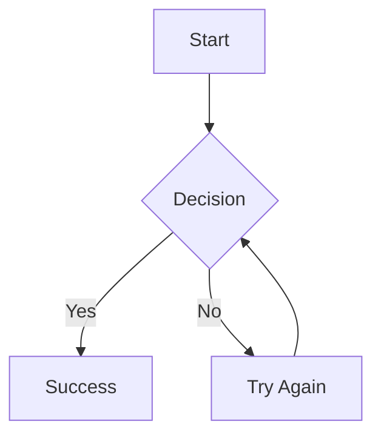

# Markdown Features

QuickDoc supports standard Markdown, MDX, and Mermaid diagrams with full theme integration.

## Code Blocks

QuickDoc supports syntax highlighting with theme-aware styling:

```javascript
function example() {
  console.log("Hello, QuickDoc!");
}
```

### Theme-Aware Code Styling
- **Background colors**: Code blocks automatically match your theme configuration
- **Consistent styling**: Inline code and fenced code blocks use the same background
- **Light/Dark mode**: Automatic color adjustments for both modes
- **Copy buttons**: Theme-aware copy buttons with configurable borders and radius

### Copy to Clipboard
All code blocks include a copy button that:
- Respects your theme's border radius setting (`none`, `sm`, `md`, `lg`)
- Uses theme colors for hover states and feedback
- Positioned correctly with `relative` containers
- Smooth animations and visual feedback

## Inline Code

Inline code like `src/config/app.config.ts` now matches the theme:
- Same background color as fenced code blocks
- Proper contrast in both light and dark modes
- Configurable borders based on theme settings

## MDX Support

QuickDoc now supports MDX files with React components:

```mdx
# Interactive Content

<Counter initialValue={5} />

<Alert type="info">
  This is an interactive alert component!
</Alert>
```

### MDX Features
- **React components**: Embed interactive React components in your documentation
- **Runtime compilation**: MDX is compiled at runtime for maximum flexibility
- **Section splitting**: MDX content is properly split into sections for navigation
- **Error handling**: Graceful fallbacks for compilation errors

## Links and Navigation

### Internal Links
Link to other pages and sections with enhanced navigation:
```markdown
[Configuration](/quickdoc/configuration)
[Cross-page anchor](/quickdoc/configuration#theme-settings)
```

### Search Integration
- **Weighted search**: Results prioritized by H1-H6 matches over content
- **Smart highlighting**: Matches highlighted in accent color with bold weight
- **Keyboard shortcuts**: Cmd+K / Ctrl+K to open search
- **Enhanced search**: Optional fuzzy search with typo tolerance
- **Proper navigation**: Search results link directly to sections with URL anchors
- **Context awareness**: Search finds parent headings for paragraph matches

### External Links
Standard markdown links work as expected and use theme accent colors:
```markdown
[GitHub](https://github.com)
```

## Tables

| Feature | Status | Theme Support |
|---------|--------|---------------|
| Tables | ✅ | ✅ |
| Code blocks | ✅ | ✅ |
| Syntax highlighting | ✅ | ✅ |
| Copy buttons | ✅ | ✅ |
| MDX components | ✅ | ✅ |
| Mermaid diagrams | ✅ | ✅ |
| Weighted search | ✅ | ✅ |
| Component library | ✅ | ✅ |

## Lists and Formatting

- **Bold text** with theme-aware colors
- *Italic text* 
- `Inline code` with theme backgrounds
- ~~Strikethrough~~
- Links with accent colors

## Mermaid Diagrams

Create diagrams directly in your markdown files:



### Mermaid Features
- **Live theme switching**: Diagrams automatically re-render when toggling dark/light mode
- **All diagram types**: Flowcharts, sequence, class, state, ER, git graphs, and more
- **Error handling**: Invalid syntax shows helpful error messages
- **Responsive**: Diagrams scale appropriately on all devices

See the [Mermaid Diagrams guide](/markdown-guide/mermaid-diagrams) for detailed examples.

## MDX Component Library

QuickDoc includes 7+ reusable components for enhanced documentation:

- **IFrame**: Embed YouTube videos, maps, and external content
- **Callout**: Highlight info, warnings, success, and error messages
- **Tabs**: Organize related content in tabbed interfaces
- **CodeBlock**: Enhanced code display with copy button and line numbers
- **Steps**: Visual step-by-step guides
- **Card**: Content containers with multiple variants
- **Badge**: Labels and tags with multiple colors and sizes

See the [Components guide](/quickdoc/components) for usage examples.

## Floating Toolbar

The floating toolbar provides quick access to:
- **Export functions**: PDF and Markdown export
- **Search**: Global search with Cmd+K / Ctrl+K keyboard shortcut
- **Dark mode toggle**: Theme switching
- **Responsive design**: Different layouts for desktop and mobile
